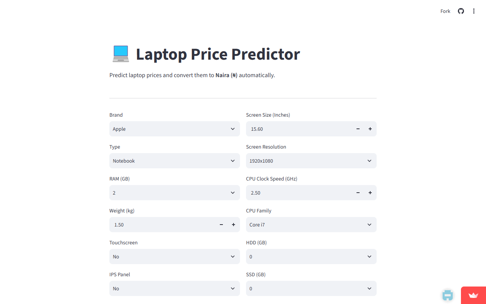

# ?? Laptop Price Predictor

A machine learning web app that predicts laptop prices in **Indian Rupees (?)** and automatically converts them to **Nigerian Naira (?)** using a live exchange rate API.

Built with a custom-engineered dataset featuring **novel GPU categorization** and other hand-crafted features not commonly seen in similar projects — resulting in improved model accuracy.

> **Live App:** [Click here to try the app](https://laptop-price-predictor-j4lpxwbqgzbxsdwavfenpf.streamlit.app/)

---

## What Makes This Project Unique

Most laptop price prediction projects online use raw GPU names as text. This project introduces a **custom binary GPU feature**:

- Laptops with a **dedicated high-performance GPU** (Nvidia/AMD discrete) ? `gpu_dedicated = 1`
- Laptops with **integrated graphics** (Intel UHD, etc.) ? `gpu_dedicated = 0`

This single feature significantly improved model accuracy because dedicated GPUs are one of the strongest price signals for laptops (Gaming, Workstation laptops cost significantly more).

**Other custom features engineered:**
| Feature | How It Was Created |
|---------|-------------------|
| `gpu_dedicated` | Binary: 1 = dedicated GPU, 0 = integrated (novel feature) |
| `Total_Pixels` | `sqrt(X_res² + Y_res²) / screen_size` — measures pixel density (PPI) |
| `Full_HD` | Binary: 1 if resolution is 1920x1080, else 0 |
| `type_score` | Ordinal encoding: Netbook=0, Notebook=1, Ultrabook=3, Gaming=4, Workstation=5 |
| `Clock_Speed_GHz` | Extracted CPU clock speed from raw CPU string |
| `IPS_Panel` | Binary: 1 if IPS display, else 0 |
| `Touchscreen` | Binary: 1 if touchscreen, else 0 |
| Log Price Target | `log(price)` used as target ? `expm1()` to reverse ? reduces skewness |

---

## Features of the Web App

- Select laptop brand, type, RAM, storage, screen, CPU, GPU
- Detects whether GPU is **dedicated or integrated** (the novel feature)
- Predicts price in **INR (?)**
- Automatically fetches **live INR ? NGN exchange rate** and shows price in **Naira (?)**
- Falls back to a static rate if the internet is unavailable
- Clean two-column Streamlit UI

---

## App Screenshot

[](https://laptop-price-predictor-j4lpxwbqgzbxsdwavfenpf.streamlit.app/)

---

## Project Structure

```
laptop-project/
|
+-- app.py                   # Streamlit web application
+-- laptop_price_model.pkl   # Trained ML model (serialized)
+-- requirements.txt         # Python dependencies
+-- README.md                # This file
```

---

## How to Run Locally

### 1. Clone the repo
```bash
git clone https://github.com/davidolufemi521/laptop-price-predictor.git
cd laptop-price-predictor
```

### 2. Install dependencies
```bash
pip install -r requirements.txt
```

### 3. Run the app
```bash
streamlit run app.py
```

The app will open at `http://localhost:8501`

---

## Model Details

| Property | Value |
|----------|-------|
| Algorithm | XGBoost (Gradient Boosting) |
| Target Variable | `log(price_INR)` — log-transformed to reduce skewness |
| Prediction Output | `expm1(log_price)` ? actual INR price |
| Features Used | 35+ engineered features (see table above) |
| Brands Covered | Apple, HP, Dell, Lenovo, Asus, Acer, MSI, Razer, Samsung, and more |

---

## Key Engineering Decisions

### Why log-transform the price?
Laptop prices are heavily right-skewed (a few very expensive laptops pull the mean up). Taking `log(price)` makes the distribution more normal, which helps the model learn better. At prediction time, `expm1()` reverses this to get the real price.

### Why encode GPU as binary (dedicated vs integrated)?
Raw GPU names like "Nvidia GeForce GTX 1080" vs "Intel UHD 620" have hundreds of unique values. Instead of one-hot encoding all of them (leading to sparse data), a single binary feature `gpu_dedicated` captures the most important price signal — whether the GPU is high-end or not. This reduced noise and improved accuracy.

### Live Currency Conversion
The app fetches live exchange rates from two sources:
1. **Frankfurter API** (primary)
2. **Open Exchange Rates API** (backup)
3. Static fallback `1 INR = ?18.5` if both APIs are down

---

## Deployment

### Deploy FREE on Streamlit Cloud:
1. Push this repo to GitHub
2. Go to **share.streamlit.io**
3. Connect your GitHub account
4. Select this repo and `app.py`
5. Click **Deploy** — done!

---

## Requirements

```
streamlit
pandas
numpy
scikit-learn
xgboost
requests
```

---

## Dataset

Based on the **Laptop Price Dataset** from Kaggle (SmartPrix/Flipkart scraped data).
Prices are in Indian Rupees (INR) — the app converts to Naira (NGN) in real time.

---

## Tech Stack

| Component | Technology |
|-----------|-----------|
| ML Model | XGBoost |
| Web Framework | Streamlit |
| Data Processing | Pandas, NumPy |
| Currency API | Frankfurter API + Open Exchange Rates |
| Language | Python |

---

## License

MIT License — free to use for research and educational purposes.
